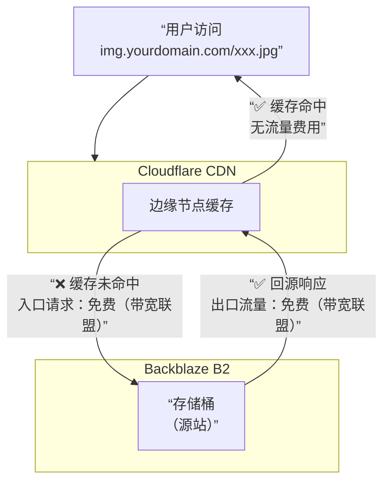

# Cloudflare Worker proxy Backblaze B2

> [!NOTE]
>
> 该项目基于 [backblaze-b2-samples/cloudflare-b2](https://github.com/backblaze-b2-samples/cloudflare-b2) 二创。

## 功能及效果

功能

- 代理 Backblaze B2 S3 兼容 API 请求
- 自动为请求添加认证签名
- 支持 GET 和 HEAD 请求方法
- 支持桶名通过路径或主机名传递

效果：私有桶链接实现公开化，并通过 cloudflare 代理 100% 省去流量


## 安装

1 克隆项目，安装依赖 

```bash
pnpm install
```

2 将配置模板复制到实际配置文件

```bash
cp wrangler.toml.template wrangler.toml
```

编辑 `wrangler.toml` 文件，配置以下参数

```toml
name = "cloudflare-b2"
workers_dev = true
compatibility_date = "2023-09-04"

main = "index.js"

[vars]
B2_APPLICATION_KEY_ID = "<your b2 application key id>"
B2_ENDPOINT = "<your endpoint - e.g. s3.us-west-001.backblazeb2.com >"
BUCKET_NAME = "<your bucket name, $path, or $host>"
ALLOW_LIST_BUCKET = "<true or false>"
RCLONE_DOWNLOAD = "<true or false>"
```


## 从配置到发布

1 配置本地开发环境

```bash
cp .dev.vars.template .dev.vars
```

2 编辑 `.dev.vars` 文件，添加 B2 密钥：

```toml
B2_APPLICATION_KEY = "<your b2 application key>"
```

3 运行 `cp .dev.vars.template .dev.vars` ，并填入密钥

4 登录 Cloudflare：`wrangler login`，构建并部署

```bash
wrangler build
wrangler deploy
```


## 注意事项

- 不要将 `B2_APPLICATION_KEY` 直接存储在配置文件中，应使用 `wrangler secret put` 命令设置
- 确保 B2 存储桶设置了适当的缓存控制头
- 该 Worker 只支持 GET 和 HEAD 请求方法
- 如果使用自定义域名，需要在 Cloudflare 控制台配置路由或自定义域

## 附录

由于 Cloudflare 和 Backblaze 都属于 Bandwidth Alliance（带宽联盟），因此从 Cloudflare 回源到Backblaze B2（即“入口流量”）也是完全免费的。

简单来说，这套方案的免费流量模式是：

* 出口流量免费：Backblaze B2 → Cloudflare CDN
* 入口流量免费：Cloudflare CDN → Backblaze B2


